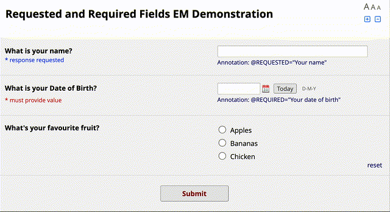

# Requested and Required Fields

[](https://zenodo.org/doi/10.5281/zenodo.11906078)

This REDCap External Module provides functionality for requesting that respondents provide an answer to a field, and displays a warning to survey respondents if any requested fields are missing a value when they try to submit. For completeness, this module also allows required fields to be treated in the same way. Fields can be annotated with @REQUESTED or @REQUIRED, both of which take an optional description, which is shown to the user when they try to submit. If the description is omitted, the field label is shown instead.



This module respects fields marked @HIDDEN(-SURVEY) and also those that are hidden due to branching logic.

## Limitations

This module does not play nicely with embedded fields. Perhaps this could be fixed, but at the moment it's just a limitation.

Unlike traditional required fields, wherein submitting the page commits other values to the database and sets the survey as partially complete, with this module enabled, clicking 'submit' does _not_ save any other entered values. Again, perhaps this could be fixed by running an AJAX call to save the data.

~~This module only considers fields to be required if they are annotated with @REQUIRED. It might be an idea in future to take fields marked Required in the designer and treat them in the same way.~~

## Installation

Install the module from the REDCap module repository and enable in the Control Center, then enable on projects as needed.

## Usage

This module adds two action tags:

| Action Tag | Description |
| --- | --- |
| @REQUESTED | Displays a modal window if the annotated field is empty when the respondent attempts to submit, but allows the respondent to submit regardless (unless there are @REQUIRED fields). With a description provided by @REQUESTED="description", the description is shown in the modal. Otherwise, the field label is shown. |
| @REQUIRED | Displays a modal window if the annotated field is empty when the respondent attempts to submit, and prevents submission. With a description provided by @REQUIRED="description", the description is shown in the modal. Otherwise, the field label is shown. |

## Configuration

This module can be configured with the following project settings:

| Setting | Default Value | Description |
| --- | --- | --- |
| Apply to fields marked as required in the project metadata? | false | If checked, fields marked as required in the data dictionary will be treated in the same way as though they were annotated with @REQUIRED. |
| Modal title | "Action Required!" | Title of the popup window showing any requested or required fields. |
| Requested text |  "The following fields are requested, although you may submit without completing them:" | Text displayed in the modal window above listed requested fields. |
| Required text |  "The following fields are required:" | Text displayed in the modal window above listed requested fields. |
| Footer text (no required fields) |  "The following fields are requested, although you may submit without completing them:" | Text displayed at the end of the modal, above the buttons, where no required fields are missing. |
| Footer text (required fields) |  "The following fields are required:" | Text displayed at the end of the modal, above the buttons, where required fields are missing. |
| Cancel button text | "Review Response" | Text for cancel button. |
| Submit button text | "Submit Now" | Text for submit button. |
| Highlight fields after displaying warning? | false | If true, highlights required and requested fields after cancelling the modal window. |
| Highlight colour for requested fields | "#d2e0ff" (light blue) | Colour used to highlight requested fields. |
| Highlight colour for required fields | "#ffd2e0" (light red) | Colour used to highlight required fields. |
| Disable green highlight | false | Disable the default green highlighting on all fields, as this will visually conflict with the highlighting added by this module. |
| Label requested fields | false | Display a label on requested fields. |
| Requested field label text | "* response requested" | Text for requested field label. |
| Requested field label colour | "#0000ff" (blue) | Colour for requested field label. |

## Citation

If you use this external module for a project that generates a research output, please cite this software in addition to [citing REDCap](https://projectredcap.org/resources/citations/) itself. You can do so using the APA referencing style as below:

> Wilson, A. (2024). Requested and Required Fields [Computer software]. https://github.com/jangari/redcap_requested_and_required_fields https://doi.org/10.5281/zenodo.11906079

Or by adding this reference to your BibTeX database:

```bibtex
@software{Wilson_Requested_and_Required_2024,
  title        = {{Requested and Required Fields}},
  author       = {Wilson, Aidan},
  year         = 2024,
  month        = 6,
  url          = {https://github.com/jangari/redcap_requested_and_required_fields}
}
```
These instructions are also available in [GitHub](https://github.com/jangari/redcap_requested_and_required_fields/) under 'Cite This Repository'.

## Changelog

| Version | Description |
| --- | --- |
| 1.0.0 | Initial release. | 
| 1.1.0 | Added support for fields marked as required in the project metadata. Fixes PHP8.0 compatibility. |
| 1.1.1 | Fixes a bug in which the module would not work with fields marked `@REQUIRED` if the option to also treat fields marked required in the metadata was not checked. |
| 1.1.2 | Allows HTML to be safely inserted in action tags, and also allows HTML and rich text from field descriptions to be correctly output. |
